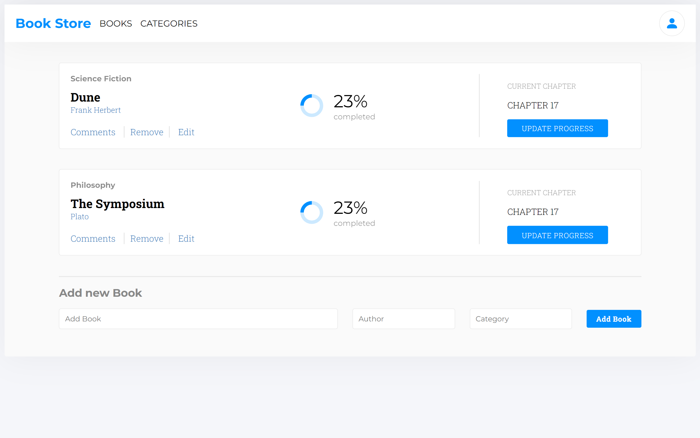

## Bookstore

> "Bookstore" is a is a webapp similar to the "Awesome Books" website I built previously. This is an MVP version of it that allows you to:
>
> - Display a list of books.
> - Add a book.
> - Remove a selected book.
##

>  

## Built With

- HTML
- CSS
- JavaScript ES6
- React

## Getting Started

This project was bootstrapped with [Create React App](https://github.com/facebook/create-react-app).
To get a local copy up and running follow these simple example steps.

### Prerequisites

- git
- Node.js
- Broswer to Display
- IDE to run and edit the code

### Setup

- open a terminal
- run ` git clone git@github.com:killy10o10/bookstore`
- run ` cd bookstore`
- run `npm install`
- run `npm run build`
- run `npm start` your default browser should load automatically with the app, if it doesn't do next and final step.
- Enter `http://localhost:3000/` in your browser

### Usage

- It can be used to display list of books.
- It can be used to add a book.

## Author

👤 **Okine Kingsley**

- GitHub: [@killy10o10](https://github.com/killy10o10)
- Twitter: [@Quami_Killy](https://twitter.com/Quami_Killy)
- Instagram: [quami_killy](https://www.instagram.com/quami_killy/)

## 🤝 Contributing

Contributions, issues, and feature requests are welcome!

## Show your support

Give a ⭐️ if you like this project!

## Acknowledgments

- Microverse community
- Hat tip to Microverse's code reviewers and to everyone who reviewed my project and made suggestions.

## 📝 License

This project is [MIT](./LICENSE) licensed.
